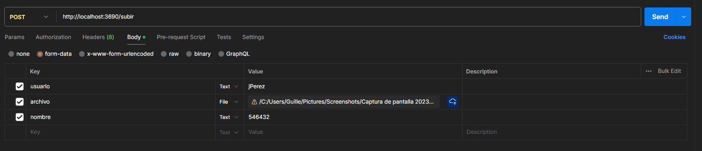

# 1. Introducción

* La aplicación se encarga de recibir un nombre de usuario, un archivo y un nombre para asignarle al archivo. El archivo lo guarda en una carpeta en google drive configurado en la aplicación.

* El nombre de usuario lo usa como nombre de carpeta y el archivo lo guarda en esa carpeta. Si no existe la carpeta, la crea.

* Si la carpeta existe en el google drive guarda el archivo en la primera coincidencia que encuentre (en caso de que existan 2 carpetas con ese nombre).
* Asi es una peticion de prueba 
* La documentacion está en http://localhost:puerto/docs entrando a la 192.168.9.129 o 0.188
* 
# 2. Importante
* Debe correr en un servidor local dentro de la empresa.
* Debe tener acceso a internet para poder subir el archivo a google drive.
* Debe existir el archivo credentials.json en la carpeta /files/credentials/ (ver más abajo como obtener el archivo)
* La ruta para subir el archivo es /subir y se accede por POST a http://ip:puerto/subir
* Se debe enviar un form-data con el archivo, en el campo "archivo", el nombre de usuario en el campo "usuario" y el nombre de la carpeta en el campo "nombre"
* Todos los errores van a estar guardados en la carpeta "logs" con su fecha y hora.
* Si la aplicación subió el archivo correctamente va a devolver un status 200.
* La aplicación no va a devolver una respuesta hasta que no se haya subido el archivo a google drive.

# 3. Instalación en windows con pm2 para producción
1. Instalar pm2 con `npm install pm2 -g`
2. Clonar el repositorio (o copiarlo)
3. Instalar las dependencias con `npm install`
4. Obtener el archivo credentials.json (ver más abajo como obtener el archivo) y guardarlo en /files/credentials/
5. Poner el nombre de la carpeta del drive en ecosystem.config.js en la variable MAIN_FOLDER, para saber como obtener el id de la carpeta ver más abajo
6. npm run build
7. Ir a la carpeta del proyecto /dist/
8. pm2 install pm2-logrotate (esto es para que los logs no ocupen mucho espacio)
9. pm2 set pm2-logrotate:max_size 10M
10. pm2 set pm2-logrotate:retain 5
11. pm2 reload all (para que se apliquen los cambios)
12. Iniciar el servidor con `pm2 start ecosystem.config.js --env production`
13. pm2 save

Nota: por defecto, windows no va a levantar el programa al iniciar la pc

### a. Configurar la cuenta de google drive
1. Crear un proyecto en google cloud https://developers.google.com/workspace/guides/create-project?hl=es-419
2. Habilitar la API de google drive https://developers.google.com/workspace/guides/enable-apis?hl=es-419
3. Activar la API https://developers.google.com/drive/api/quickstart/nodejs?hl=es-419#set_up_your_environment

### a. Obtener credentials.json la primera vez que se usa la cuenta de google
1. https://console.cloud.google.com/
2. Seleccionar el proyecto
3. API y servicios
4. Credenciales
5. Administrar cuentas de servicio
6. Crear cuenta de servicio
7. Le ponemos un nombre > crear y continuar
8. Seleccionamos el rol basico > editor > continuar > Listo
9. Ir al paso b. Obtener credentials.json cuando la cuenta de google ya tiene todo configurado

10. En el drive crear una carpeta llamada documentos
Compartimos la carpeta con la cuenta de servicio que acabamos de crear, es el correo que está en la pantalla de cuentas de servicio
Le damos permisos de editor

11. El programa necesita el id de la carpeta documentos creada, esta en la url despues del folders/
Por ejemplo si la url de la carpeta documentos es https://drive.google.com/drive/u/3/folders/1Xq5oHaOjeQfIDFWDfeADyO4o51FZlRu9?hl=es-419
Entonces el id es 1Xq5oHaOjeQfIDFWDfeADyO4o51FZlRu9
Este id lo pegamos en el .env en la variable MAIN_FOLDER
También lo pegamos en ecosystem.config.js en la variable MAIN_FOLDER
Y en docker-compose.yml en la variable MAIN_FOLDER

### b. Obtener credentials.json cuando la cuenta de google ya tiene todo configurado
https://console.cloud.google.com/
Seleccionar el proyecto
API y servicios
Credenciales
Administrar cuentas de servicio
Seleccionar la cuenta de servicio habilitada
Claves
Agregar clave
Crear clave de cuenta de servicio
json
El json se descarga solo, hay que cambiarle el nombre a credentials.json y guardarlo en /files/credentials/

# 4. Errores
* **No se recibió ningún archivo:** fijarse que la clave se llama "archivo" y que es formato File. Y que tenga un archivo seleccionado.
* **No se recibió ningún nombre de usuario:** fijarse que la clave se llama "usuario" y que sea un string.
* **La ruta es incorrecta:** fijarse que la ruta sea /subir y que sea por POST.
* **Solo se permite subir un archivo a la vez:** fijarse que el campo "archivo" sea de tipo File y que no sea un array. También fijarse que no esté seleccionado más de un archivo.
